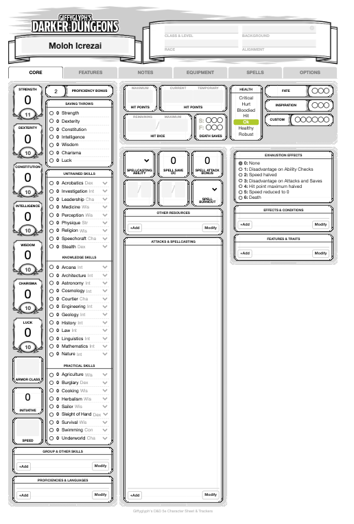

# 5e Darker Varlyn

This sheet is based on 5e Darker Dungeon; https://github.com/Roll20/roll20-character-sheets/tree/master/5e%20Darker%20Dungeons

The rules this sheet tries to follow are located here: http://dnd.rigo.nu/

## Differences
- The skills list it totally different and divided into three main categories; *Untrained*, *Knowledge* and *Practical*.
- Luck is a new ability score.
- Moved around some boxes on the pages to fit our playstyle better
- Repurposed training to a custom counter on the core page
- Redefined the levels of condition_health (and also added a condition_health_max to more easily use this for token bars) to the following:
  - HP < 10 ➔ Critical *(note that if Max HP is < 20 then it's Critical when HP < MaxHP/2)*
  - HP < MaxHP/4 ➔ Hurt
  - HP < MaxHP/2 ➔ Bloodied
  - At least half Hit Dice used ➔ Hit
  - Some damage received ➔ Ok
  - Full HP, but some Hit Dice used ➔ Healthy
  - Full HP and full Hit Dice ➔ Robust
- A *Defence Roll* (clicking on AC) makes a `(1d20-AC)*-1` roll; which show the value the opponent needs to have to be able to hit.
- A *Saving Throw Attack Roll* (clicking on Spell Save DC) make the same type of roll as Defence roll; showing what Saving Throw value the target needs to have to pass.

## Preview

