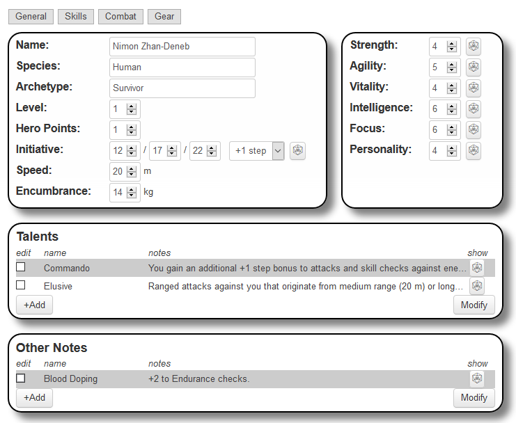

# Alternity 2018 Sheet

This character sheet is designed to be used with the 2018 edition of the Alternity roleplaying game.

## Alternity Disambiguation

At the time of writing, there were two editions of Alternity:

* **Alternity 1998.** 
  * Published by TSR (later Wizards of the Coast) in 1998. [More info.](https://en.wikipedia.org/wiki/Alternity)
  * This sheet isn't designed for this version. See instead [this sheet](https://github.com/Roll20/roll20-character-sheets/tree/master/Alternity-RPG).
* **Alternity 2018.**
  * Published by [Sasquatch Game Studios](http://www.sasquatchgamestudio.com/products/alternity/) in 2018.
  * Available for purchase on [Drive Thru RPG](https://www.drivethrurpg.com/product/245263/Alternity-Core-Rulebook).

The shared name is not a coincidence. The two systems share authors, rules and a general *vibe*.

# Using this Sheet

[This article](https://roll20.zendesk.com/hc/en-us/articles/360037773373) explains how to load a sheet into your game. It also explains how to used a [modified version](https://roll20.zendesk.com/hc/en-us/articles/360037773373#HowtoUseCharacterSheets-ModifyingaCommunitySheet) of this sheet.

This sheet is in a folder called `Alternity-2018`.

# Design Philosophy

This sheet exists as a [minimum viable product](https://en.wikipedia.org/wiki/Minimum_viable_product). It has Roll20 "basics" like click-to-roll skills, but it isn't otherwise advanced in terms of style or automation.

This sheet may be improved over time, so check back for updates.

# Useful Macros

(This section will be updated in the future with macros useful when playing Alternity 2018 on Roll20.)

# About the Author

My name is Joel and you can find contact details [here](https://deck16.net/contact). Email is preferred.