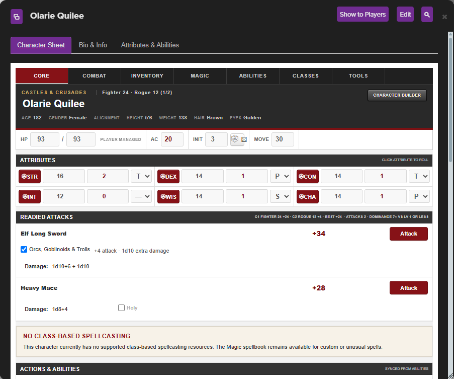
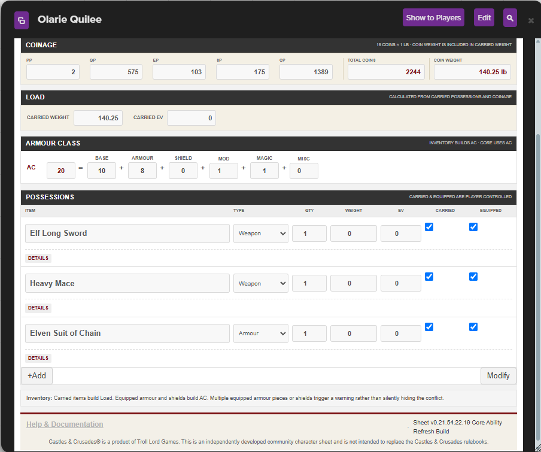
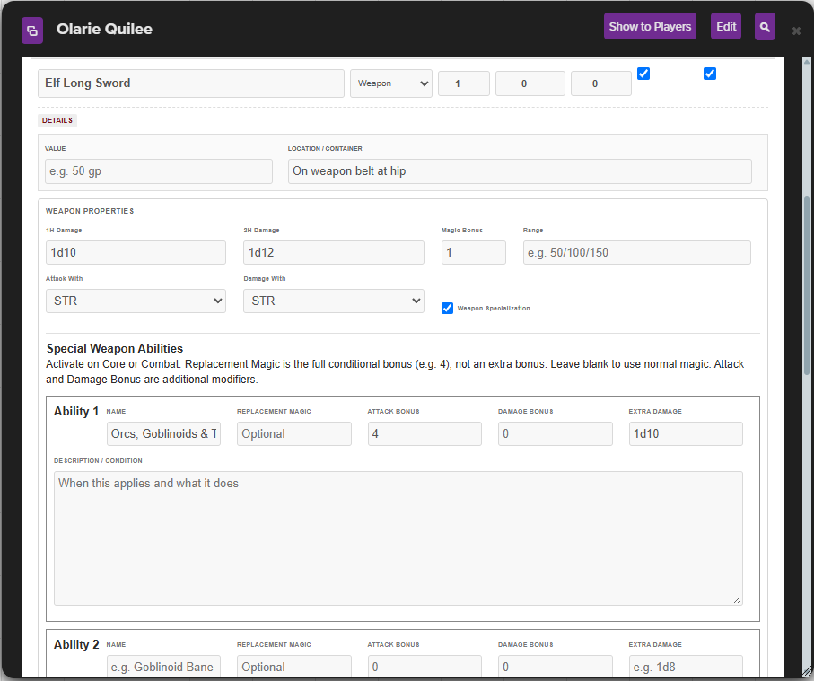
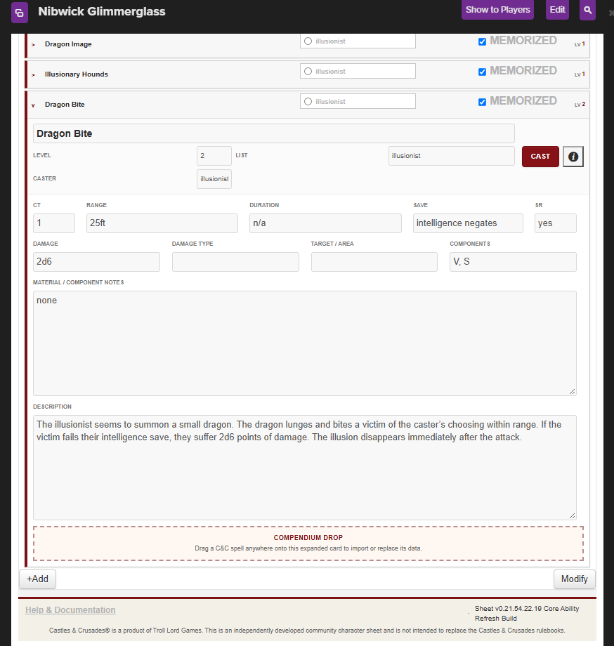

# Castles & Crusades — GameOnMagill

Version 0.21.54.22.19 · David Magill · Roll20 user 1007217

## Status

Review/testing package. Not yet approved or published in the Roll20 sheet selector.
The author completed a single-class live testing pass with sampled rolls. Special weapon toggles and Bard Exalt were retested successfully. This does not claim exhaustive rules validation.

Outstanding: Dragon Mount imported with an unresolved caster, and editing its List did not resolve the reported case. Cause remains under investigation. Dedicated Dual Class and multiclass testing remains pending.

## Custom game installation

Paste gameonmagill.html into HTML/Layout and gameonmagill.css into CSS in the custom sheet editor. Save and reopen the character. These are the v19 files with existing attribute names preserved.

## GitHub upload

Extract the ZIP. Drag the entire Castles-and-Crusades-GameOnMagill folder onto the upload page for elrikthebastard/C-C-character-sheets, branch gameonmagill-cnc. Keep the folder structure; do not upload the ZIP itself. Commit directly to that branch.

Suggested commit message: Add GameOnMagill C&C sheet v0.21.54.22.19 for review

Before requesting public inclusion, finish the outstanding checks and review the current Roll20 contribution requirements. SUBMISSION.md is a draft description, not a completed submission checklist.

## Screenshots

Castles & Crusades is a product of Troll Lord Games. This is independent community work, not publisher-endorsed.
