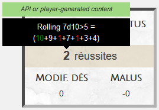

# Imperator

Feuille de personnage pour le JdR *Imperator*.

Edité par [JdR Editions](http://www.jdreditions.com/).

Ecrit par Bruno Guérin.

---

## Utilisation de l'API

Dans le système d'Imperator, un jet de dés se fait en lançant plusieurs d10 et en comparant chaque résultat à un seuil de réussite. Un dé supérieur ou égal au seuil compte pour une réussite. Un 10 compte une réussite supplémentaire. Un 1 enlève une réussite.

Ce système ne peut pas être réalisé par les types de jets de dés proposés par Roll20. Il existe donc un script que les utilisateurs professionnels peuvent utiliser. Si cela est fait, alors il faudra cocher la case tout en haut de la fiche, ce qui permettra d'avoir des jets correctement comptabilisés. Sinon, il reviendra aux utilisateurs de vérifier eux-même la présence ou non de 10 ou de 1 dans les jets lancés et d'adapter le total de réussite en fonction.

Avec API, résultat correct : 

Sans API, résultat incorrect (devrait être 10) : 