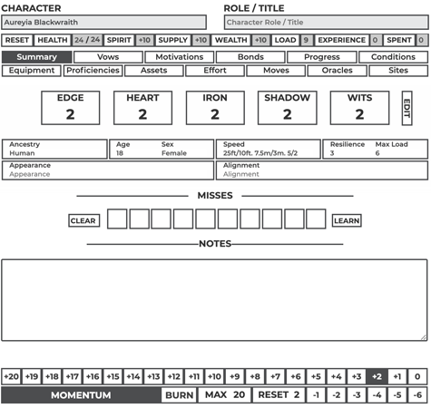

# Ironcrunch - Character Sheet
## Preview Image

## Building Sheet
This sheet uses [pugjs](https://www.google.com) for HTML templating, along with [Stylus](https://www.google.com) from CSS templating.
To build finished sheet run the following commands from command line or terminal:
```bash
cd src
npm install

// Mac or Linux
npm run build:pug 
// Windows
npm run build:pug:win

npm run build:css
```
These will then generate a dist folder that will have the finished code. From their you can upload them into the custom sheet sandbox for testing.

## Coding Standards
### Comments
```pug
//-
  Generates a repeating fieldset for bonds.
  Expands when clicking the DETAILS label.

  @mixin
  @outputs repeating html fieldset

  @memberof components/bonds
```

## Compatibility
The sheet has been tested across multiple browsers and devices, show below in the compatibility matrix:
|Browser|Windows|MacOs|Android|iOS|
|---|---|---|---|---|
|Chrome|yes|yes|yes|yes|
|Firefox|yes|yes|yes|yes|
|Safari|no|yes|no|yes|

## Licensing
Ironcrunch is licensed under Creative Commons Attribution-NonCommercial-ShareAlike 4.0 International license. Explicit permission has been given from the developer to include rulebook content such as Moves, Assets, Oracles, Ancestries, Equipment, etc...

### Ironcrunch License
This work is based on Ironsworn (found at www.ironswornrpg.com), created by Shawn Tomkin, and licensed for our use under the Creative Commons Attribution-NonCommercial-ShareAlike 4.0 International license.