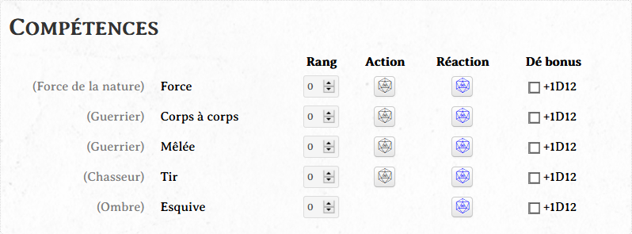
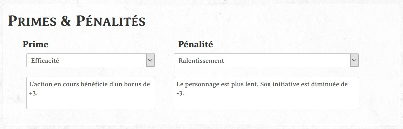
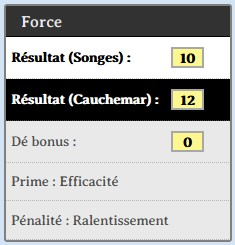

# Les Oubliés

Feuille de personnage pour le JdR *Les Oubliés*.

Edité par [Les XII Singes](https://www.les12singes.com/).

Ecrit par Samia Aci-Sèche et Geoffroy Hassoun.

---

## Onglet combat

Un onglet spécifique au combat est présent, qui contient normalement toutes les fonctionnalités spécifiques à une scène d'action.

Des primes et pénalités peuvent être sélectionnées (cf. ci-dessous). Et les compétences *Force*, *Corps à Corps*, *Mêlée*, *Tir* et *Esquive* sont de nouveau renseignées ici, avec deux jets différents selon si ces compétences sont utilisées en tant qu'action ou réaction.

### Primes et pénalités

Il est possible de sélectionner des primes et pénalités et d'afficher leur description.

Si une prime est sélectionnée (et il en va de même pour les pénalités), alors un bonus éventuel sera automatiquement ajouté lors du jet correspondant, si possible. Typiquement, le bonus de +3 obtenu avec la prime *Efficacité* sera automatiquement ajouté lors des actions en combat. A l'inverse, le malus de -3 à l'initiative obtenu par la pénalité *Ralentissement* n'est pas compté automatiquement puisqu'il ne s'applique pas à un jet précis mais plutôt à une action. C'est alors au joueur et au MJ de ne pas l'oublier.
Les primes et pénalités sélectionnées sont rappelées lors d'un jet, pour faciliter ce rappel.

