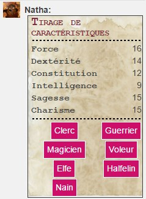
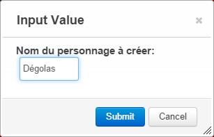
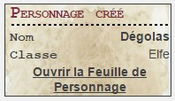

# Portes, Monstres et Tr&eacute;sors
_A french retroclone of D&D B/X, based on Labyrinth Lord._

Feuille de Personnage pour **PMT**, un r&eacute;tro-clone de **Donjons & Dragons Basic** (les fameuses bo&icirc;tes rouge et bleu).

PMT est une adaptation de **Labyrinth Lord**, r&eacute;alis&eacute;e par [Arasmo](http://www.legrog.org/biographies/james-arasmo-manez).

Le jeu complet est disponible gratuitement en PDF sur le site du [Scriptorium](https://le-scriptorium.fr/jeux-de-role/portes-monstres-tresors/), et en version papier sur [Lulu](http://www.lulu.com/shop/daniel-proctor-and-james-manez/portes-monstres-tr%C3%A9sors/hardcover/product-22096059.html) ou [Amazon](http://www.amazon.fr/Portes-Monstres-Tresors-daventures-fantastiques/dp/1508659044).

# Version courante
4.5 [Screenshot](pmt_v4.jpg)

# Script API de création de personnage
Un [script API](pmt.js) est disponible pour créer des personnages rapidement (le taux de mortalité est élevé en OSR ;) ).
Ce type de script nécessite un compte Roll20 Pro pour être exécuté.

Ajoutez le script à votre campagne (pensez à resauvegarder le script avant chaque session, sans modification, si jamais il ne répond plus. L'API Roll20 a parfois du mal à se "réveiller").

Pour lancer le tirage d'un personnage, utilisez les commandes suivantes (ou créez des macros contenant ces commandes) :

* 3d6 dans l'ordre :
```
!pmt-rollchar 0
```
* 4d6 dont on garde les 3 meilleurs, dans l'ordre :
```
!pmt-rollchar 1
```

Dans le chat s'affiche le tirage de caractéristiques, suivi de boutons API (rose) indiquant le nom des classes que vous pouvez créer (en fonction de prérequis et du tirage) :


Cliquez sur une des classes.
Un nom de personnage doit être renseigné :


Un message dans le chat indique lorsque la création du personnage est terminée, et un lien permet d'ouvrir la feuille de personnage Roll20 (il faudra probablement cliquer sur l'onglet "Character Sheet" pour voir la feuille) :


**NB** : lors de la première ouverture de la session après la création du personnage, des opérations sont menées pour finaliser la feuille : complétion des sections répétables de sort, attaques et équipements.
Si ces informations n'apparaissent pas, fermer la feuille et réouvrez la après quelques secondes. Au pire, recharger la campagne en rafraîchissant le cache (Ctrl+F5) et réouvrez la feuille.

Par défaut, le personnage créé est attribué au joueur qui a cliqué dans le chat (même s'il est visible par tous, seul ce joueur et le MJ pourront modifier le personnage).

# Notes de version

## v4.5 (17 Septembre 2017).
Optimisation technique.

## v4.4 (18 Février 2017).
Correction du calcul d'encombrement.

## v4.3 (18 Décembre 2016).
Correction du calcul d'encombrement.

## v4.2 (28 Février 2016).
* Correction de l'infobulle de la case à cocher "R" dans les sorts : il s'agissait de "Sort Réversible"
* Correction de l'affichage des sorts avec Firefox

## v4.1 (22 Février 2016).
Possibilité d'agrandir/réduire le champ de description d'un sort.

## v4.0 (29 Janvier 2016).
* Changement de la police des zones de saisie de 'Times' à 'Patrick Hand' (aspect plus 'manuscrit')
* Quelques ajustements de mise en page
* Élargissement du template de jet dans le chat
* Agrandissement et complétion de la section "Sorts" avec l'ajout du caractère réversible du sort, durée, portée et description du sort.
* Ajout d'un bouton d'information sur les sorts, permettant de montrer le sort dans le chat
* Mise à jour du [script API](pmt.js) de création de personnage :
  * Correction des sorts d'elfe et magicien : conformément aux règles, 2 sorts de niveau 1 et un sort de niveau 2 sont tirés au hasard
  * Les sorts de niveau 1 et 2 d'elfe et magicien ont toutes les informations pré-renseignées
  * Tous les sorts de Clerc de niveau 1 ont toutes les informations pré-renseignées

## v3.1 (17 Janvier 2016).
* Ajout du nom du personnage sur tous les templates de jet dans le chat (utile lorsqu'un joueur contrôle plusieurs personnages)
* Ajout de champs de saisie pour le titre et les langues supplémentaires du personnage
* Agrandissement de la zone du modificateur de DEX pour le calcul de la CA (une valeur négative n'était pas visible)
* Correction du calcul automatique des distances de mouvement en fonction de l'encombrement
* Correction de l'indicateur de succès ou d'échec sur les jets de caractéristiques : un résultat égal est une réussite
* Correction du jets de dégâts des attaques : le minimum affiché est désormais 1
* Mise à jour du [script API](pmt.js) de création de personnage :
  * Correction des sorts de Clerc : désormais, tous les sorts de niveau 1 sont ajoutés à la feuille
  * La CA ascendante est désormais activée par défaut
  * Correction du nom des armures, en vertue de l'[errata de PMT du 03/01/2016](http://www.scriptorium.d100.fr/wp-content/uploads/2016/01/PMT-errata-3-01-16.pdf)
  * Les distances de mouvement se mettent correctement à jour à la création du personnage

## v3.0 (Janvier 2016).
Les personnages existants ne sont malheureusement que partiellement rétro-compatibles.
Il faudra reprendre certains éléments : classe, attaques et équipements notamment.

Nouveautés :

* Pour les comptes pros : [script API](pmt.js) permettant la création accélérée de personnage par tirage aléatoire. Cf. ci-dessus.
* Pour tous les types de comptes :
  * Mise en page légèrement revue pour une meilleure lisibilité (normalement ...)
  * Calcul automatisé des modificateurs de caractéristiques (modifiables au besoin), dont le nombre et le moral des Compagnons liés au Charisme (nouveaux champs).
  * Ajout d'un jet de réaction lié au Charisme.
  * Ajout d'un champ de saisi du bonus d'XP
  * Restriction du champ de saisie de la classe à une liste des classes de PMT v2 (restriction pour pouvoir gérer les affichages automatiques dépendants de la classe)
  * Suppression du champ optionnel "Race" (cf. gestion de la classe ci-dessus)
  * Option sur la feuille (donc par personnage) pour gérer les CA Descendante (par défaut) ou Ascendante : l'affichage est modifié en conséquence, la CA recalculée (cf. ci-dessous) et le modificateur d'attaque en CA ascendante est renseigné à minima à 1 si nécessaire.
  * CA détaillée sous la forme : CA (descendante) = Armure - Bouclier - Mod. Dex, ou CA (ascendante) = Armure + Bouclier + Mod. Dex. Les CA d'armure et de bouclier sont saisissables, le reste est calculé.
  * Actions, capacités spéciales et liste de sorts affichés et éventuellement prérenseignés automatiquement en fonction de la classe choisie (valeurs pour le niveau 1, concernant les compétences de Voleur). Les sorts restent à saisir.
  * Calcul automatisé du poids total porté/de l'encombrement et des vitesses de déplacement (modifiables cependant).
  * Bonus/Malus optionnel demandé pour tous les jets désormais, y compris attaques
  * Info-bulle du détail des jets d'attaque et de dégâts clarifié
  * Ajout du jet de suprise dans les actions

## v2.2 (Ao&ucirc;t 2015).
Am&eacute;lioration de l'affichage des r&eacute;sultats des jets de caract&eacute;ristiques, sauvegardes et talents avec indication de succ&egrave;s ou d'&eacute;chec.

## v2.1 (Avril 2015).
Correction d'une anomalie d'affichage du logo PMT avec Firefox.

## v2.0 (Avril 2015).
Des jets mieux mis en forme dans le chat, avec l'utilisation des nouveaux _templates_ Roll20.
Ajout du bonus d'attaque pour l'option CA ascendante.
Quelques ajustements visuels.
Gestion des d&eacute;g&acirc;ts maximum en cas de _Coup de Ma&icirc;tre_ (critique). **Attention**, effet de bord : il faut re-s&eacute;lectionner tous les d&eacute;s dans les feuilles de personnage cr&eacute;&eacute;es en v1.x

## v1.2 (2014-12-21).
Affichage des jets plus compacts dans le chat.
Enrichissement de l'&eacute;quipement : richesses (pi&egrave;ces), encombrement et vitesses de d&eacute;placement.

## v1.1 (2014-12-16).
Correction du HTML pour retirer les accents r&eacute;siduels et attributs inutiles.

## v1.0 (2014-12-07).
Cr&eacute;ation.
