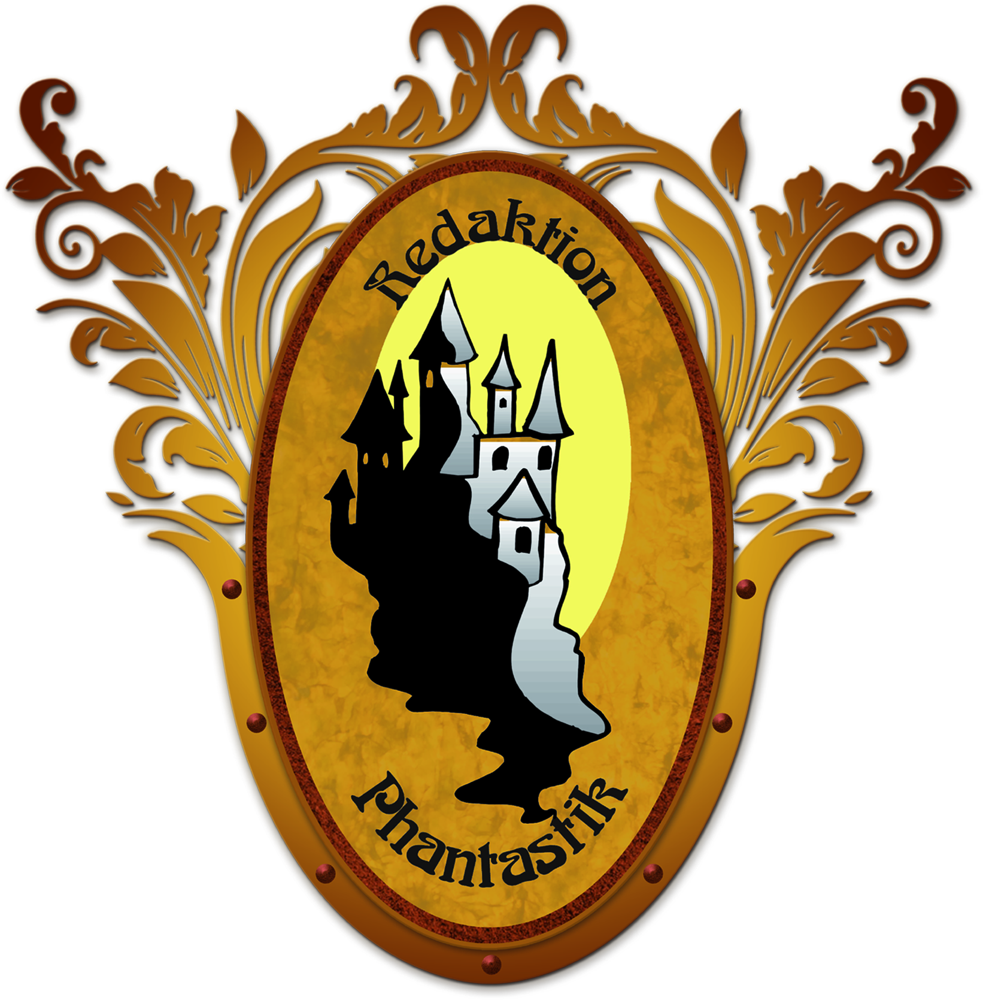

# Private Eye 5th ed. Character Sheet

This is a character sheet for use on Roll20.net with the latest Private Eye Edition (5th), a game made by
[Redaktion Phantastik](https://www.redaktion-phantastik.de/).

## Changelog

### 2024-03-18:
- Initial character-sheet submission
#### 2024-03-26:
- Bugfix: fix avatar-height crashing layout.
- Feature: add toggable dynamic modifiers: if active, user will be asked to input a modifier at the start of each roll.

## Feedback
If you have an issue then let me know, either by opening an issue and tagging me in Github or by sending me a
private message on Roll20 ([@Hkrtthr](https://app.roll20.net/users/12649430/hrkrtthr)).