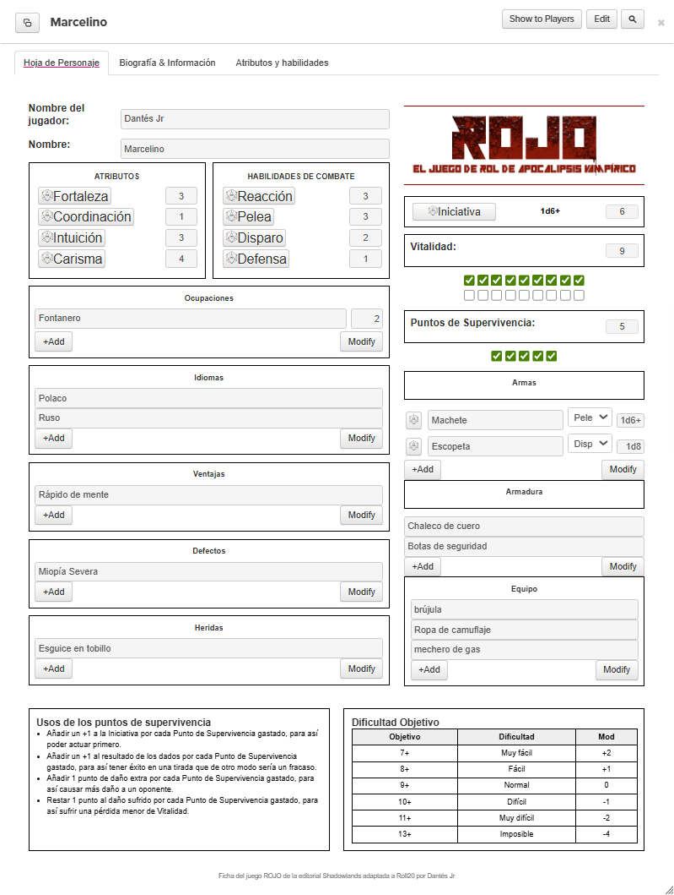

# Ficha de Personaje - ROJO (Roll20)

Esta es la ficha oficial para el juego de rol **ROJO: El juego de rol de Apocalipsis Vampírico**, desarrollada específicamente para integrarse en **Roll20**.  
Diseñada para mantener la estética sobria y formal del juego original, esta hoja es limpia, funcional y está optimizada tanto para jugadores como para el Director de Juego.

---

## Características

- Diseño a dos columnas fiel al original del juego.
- Logo oficial de ROJO en la cabecera.
- Tiradas automatizadas usando un rolltemplate personalizado llamado `rojo`.
- Cálculo automático de **Iniciativa** y **Vitalidad**.
- Campos repetibles para:
  - Armas
  - Armadura
  - Equipo
  - Ocupaciones
  - Idiomas
  - Ventajas, Defectos y Heridas
- Seguimiento visual de **Puntos de Supervivencia** y **Vitalidad** con casillas.
- Tabla de Dificultad y resumen de uso de PS integrados al final de la hoja.
- Enlace de créditos editable en el pie.

---

## Vista previa

---

## Cómo usar esta hoja en Roll20

### Opción 1: Uso personal en tus partidas

1. Abre tu partida en Roll20.
2. Ve a **Configuración del juego**.
3. En la sección **"Hoja de personaje personalizada"**, copia el contenido de `sheet.html` y `sheet.css`.
4. Guarda los cambios.

### Opción 2: Subida oficial

Para que la hoja esté disponible para toda la comunidad de Roll20, debe enviarse como **pull request** al [repositorio oficial de hojas de personaje de Roll20](https://github.com/Roll20/roll20-character-sheets).  
(Si deseas hacerlo, consulta la guía oficial de Roll20 o contacta con [Shadowlands Edi]()
