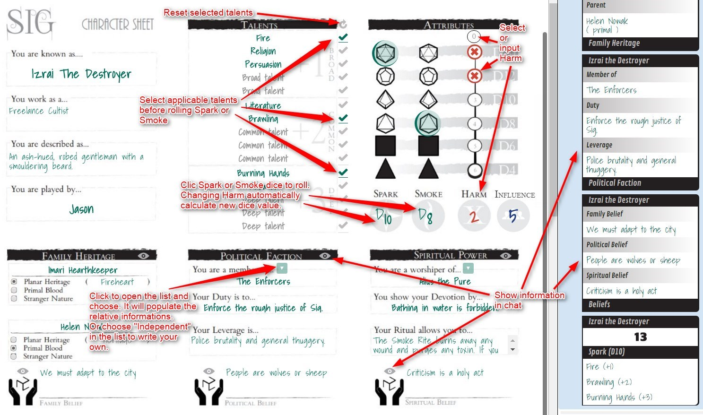

# Sig: The City Between

There is only one true city; a place of multiversal trade, cultural exchange, and mixed blood. A place where monsters come to scheme and gods come to die.

[Sig: The City Between](http://www.genesisoflegend.com/products/sig/) is the nexus of the multiverse. It’s a city connected to everywhere, a refuge for the oppressed and a prize for tyrants. It’s a place where culture is at the forefront, with diverse faiths and tongues struggling for space in the crowded metropolis. It’s a city of families, both whole and broken.

Sig is also a launching point, allowing fools and heroes to venture into the eternal planes of existence. Each plane is made of concepts, of elements, or of ideals that resonate through the entire ‘verse. The planes impose their own Beliefs on Sig, and on the infinite primal worlds beyond.

Each of the planes is also home to unique peoples, from the Giants of the Elemental Plane of Stone to the Wyrms of the Ideological Plane of Destruction. The planes are home to mighty Powers; gods, demons, and stranger things which send their servitors to spread their faith into the City Between. The planes even offer resources to the bickering politicalFactions and warring guilds that control Sig’s hungry streets.

Visit the Elemental Plane of Flame to test yourself in scorched wastelands of the Crucible. Seek answers to hidden secrets in the Umbral Delta of the Conceptual Plane of Shadow. Defend yourself in The Final Court, where the Seven Magistrates provide final remedy to any injustice.

# Current version
1.1 [Screenshot](sig.jpg)

Click to enlarge:

# Release notes

## v1.1 (2017-09-17)

Technical optimisation.

## v1.0 (2017-06-04)

Creation of the sheet.
