# Savage Worlds (french)

Feuille de personnage (FdP) avec jets intégrés pour **Savage Worlds**, **Beasts & Barbarians**, **Deadlands Reloaded** et **Lankhmar**.
Basée sur les traductions éditées par [Black Book Editions](http://www.black-book-editions.fr/catalogue.php?id=58).

# Version courante
3.3 Captures d'écran :
[Style Savage Worlds](sawofr_style_sawo.jpg)
[Style Beasts & Barbarians](sawofr_style_bnb.jpg)
[Style Deadlands](sawofr_style_deadlands.jpg)
[Style Lankhmar](sawofr_style_lankhmar.jpg)

# Configuration

## Configuration:Généralités

L'onglet "Configuration" de la feuille de personnage permet de paramétrer le personnage : style visuel, type de personnage, compétences affichées etc.
**Attention** : les modifications apportées ne sont valables **que** pour le personnage courant.
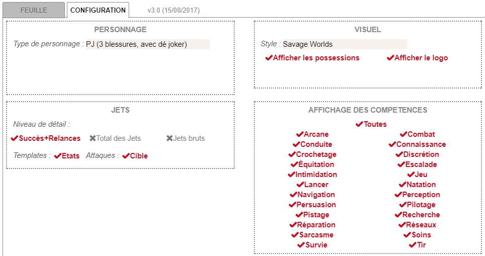

## Configuration:Personnage

Une liste déroulante permet de choisir le type de personnage : 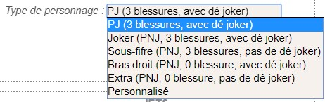.
**Attention** : cela n'a aucun effet sur les droits Roll20 des joueurs d'accéder à une fiche de personnage. Ces droits doivent être assignés par le MJ classiquement, via l'interface de Roll20. Cela n'a d'influence que sur le comportement de la feuille de personnage.

A part le choix "Personnalisé", les différentes entrées dans la liste vont modifier :
* l'affichage "PNJ" ou "PJ" (affichage de la progression par exemple)
* l'affichage du nombre de blessures disposibles
* la valeur par défaut du dé joker (qui peut être "Aucun" et lance alors 0d4)
* l'affichage par défaut des possessions
* l'affichage par défaut du logo

Le choix "Personnalisé" va permettre de définir manuellement chaque élément :
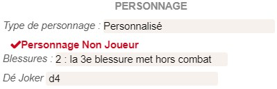

## Configuration:Visuel

Les différents paramètres permettent de définir :
* le style visuel / le jeu : 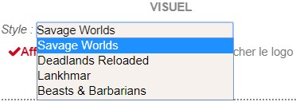
* l'affichage ou non du de la section "Possessions"  (pour gagner de la place écran)
* l'affichage ou non du logo (pour gagner de la place écran)

**Attention** : le choix du style peut avoir un effet sur le fonctionnement de la feuille de personnage (par exemple, la présence d'une compétence "Tripes" et d'une caractéristique dérivée "Trempe" pour Deadlands).

## Configuration:Jets

Voir **Notes sur les Jets** ci-dessous.

## Configuration:Compétences

Les compétences peuvent être affichées/masquées individuellement : ceci est utile pour se conformer aux particularités du setting de la campagne, et/ou pour gagner de la place à l'écran, en masquant les compétences non entraînées, et en utilisant le bouton "Non entraîné" à la place : .

La case à cocher "Toutes" permet de décocher ou cocher tous les compétences en un clic. 

Les compétences décochées ne seront pas affichées sur la feuille, mais si leur valeur (dé) a été modifiée, elles sont conservées.

Les compétences spécifiques à un setting (comme "Tripes" pour Deadlands) ne sont pas concernées par ce paramétrage et sont toujours affichées, si le style visuel correspondant a été choisi.

# Notes sur les Jets

## Jets:Pénalités
Les pénalités de jet dues aux Blessures, à la Fatigue et à l'Encombrement sont automatiquement prises en compte dans les 3 modes de jet (voir ci-dessous).
Dans les 2 modes d'affichages par template, l'état du personnage peut être optionnellement affiché (activé par défaut), rappelant ces éventuelles pénalités :
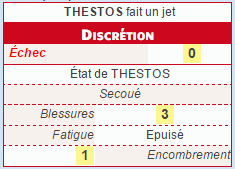

## Jets:Modes d'affichage des jets
La feuille permet 3 modes d'affichage des jets :

Ces options sont détaillées ci-dessous.

Ce choix se fait par personnage, dans l'onglet Configuration, et peut être changé à tout moment (on peut passer de l'un à l'autre, au besoin).

Quel que soit le mode choisi, un modificateur ponctuel/circonstanciel est toujours demandé :

Un modificateur du même type est demandé pour le jet de dégâts intégré aux jets d'attaques.

Dans le cas des Jets de Lancer, de Tir, ou d'armes/attaques utilisant une de ces compétences, la Portée est demandée et intégrée au jet :
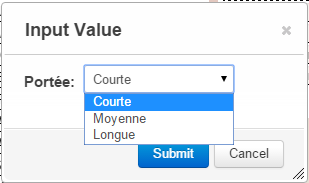

Pour les jets de Tir, l'utilisation du Dé Joket est optionnelle (pour gérer les Cadences de Tir supérieures à 1) et son utilisation doit être confirmée :
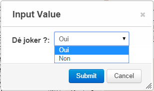

### Jets:Option 1 : Succès + Relances
Les jets demande une difficulté, ou une cible pour les jets d'attaques et dégâts si l'option est activée, avant de lancer les dés.
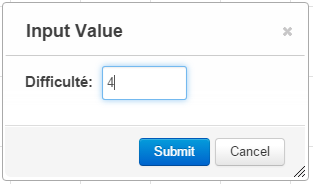
Une cible dans Roll20 est un autre pion, lequel doit être associé à une feuille de personnage dont les caractéristiques ont été renseignées.

Le choix d'une cible ou le renseignement d'une difficulté permet de calculer et d'afficher la réussite du jet (d'attribut, de compétence, d'attaque ou de dégâts) avec les possibilités de résultat suivantes :

* Échec (-1 succès+relances),
* Succès sans relance (succès + 0 relances)
* Succès+Relances :
  * résultat de 1 : un succès et une relance
  * résultat de 2 : un sucècs et 2 relances
  * etc.

Le détail du calcul (et du résultat individuel des dés) est visible dans l'info-bulle du jet :
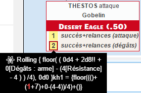

Dans le cas des attaques, en cas de relance, 1d6 explosif est automatiquement ajouté aux jets de dégâts :
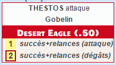
NB : techniquement, aboutir à ce résultat contraint à lancer 2 fois le jet de dégâts (une fois avec, une fois sans le +1d6!!) et d'afficher l'un ou l'autre en fonction de la réussite de l'attaque (si relance donc). De fait, avec les dés 3D activés, cela peut apparaître un peu ... confus (beaucoup de dés sont lancés).

### Jets:Option 2 : Total des jets
La feuille ne demande pas d'autre renseignement que les éventuels Modificateurs circonstanciels (cf. ci-dessus), effectue le jet demandé (y compris dégâts s'il s'agit d'une arme/attaque) et affiche un template avec le total de chaque jet.
Le détail du calcul (et du résultat individuel des dés) est visible dans l'info-bulle du jet.
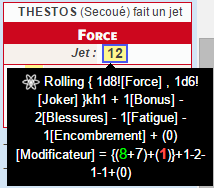
Au MJ et/ou aux joueurs de calculer la réussite ou l'échec, les relances éventuelles etc.

Dans le cas d'attaque, le d6 explosif de dégâts supplémentaires en cas de relance est directement lancé, et affiché à part (au MJ et/ou aux joueurs de le prendre en compte si nécessaire) :
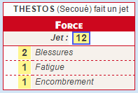

### Jets:Option 3 : Jets bruts
La feuille ne demande pas d'autre renseignement que les éventuels Modificateurs circonstanciels (cf. ci-dessus), effectue le jet demandé (y compris dégâts s'il s'agit d'une arme/attaque) et l'affiche entièrement détaillé dans le chat, façon "macro", sans template.
Dans le cas d'attaque, le d6 explosif de dégâts supplémentaires en cas de relance est directement lancé, et affiché à part (au MJ et/ou aux joueurs de le prendre en compte si nécessaire).
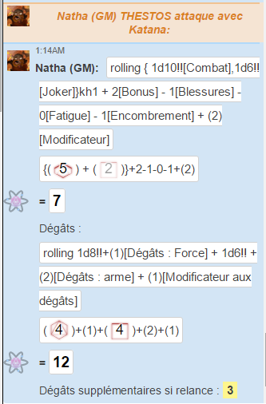

# Autres Notes

## Mise en place des pions
Les 3 "barres"/propriétés visibles des pions peuvent être associées à n'importe quel attribut de la FdP, à votre convenance.
Il n'y a (pour l'instant) aucun automatisme lié à ces propriétés.

## Raccourcis/barre de macro
Tous les boutons peuvent être glissés/déposés dans la barre de macro pour créer un bouton "raccourcis".

## Pouvoirs
Aucun jet/automatisme n'est pour l'instant intégré dans la FdP concernant les Pouvoirs, si ce n'est de pouvoir les saisir et les montrer dans le chat, ou (nouveauté version 2.0) de créer des attaques utilisant la compétence Arcane.
Les suggestions sont les bienvenues à ce sujet.
NB : décrémenter les PP automatiquement au lancement d'un pouvoir nécessiterait l'utilisation d'un script API, donc d'un compte "Pro".

# Notes de version

## v3.2 - v3.3 (2019-02-03)

* Sheet is now multilingual with English translation / la feuille est désormais multilingue avec une traduction anglaise inclue. Thanks to Cassie Levett / Merci à Cassie Levett !
* "Success + Raise(s)" rolls setting now show the direct result of number of raises (no more maths!) / L'option de jets "Succès + relance(s)" montre désormais le résultat durect du nombre de relance(s) (moins de calcul mental !)

## v3.1 (2017-09-17)

* Correction de l'utilisation de la compétence Arcane pour les jets d'arme, en mode "Succès+Relance"
* Optimisation technique

## v3.0 (2017-08-15)

* Nouveaux choix de styles visuels pour **Beasts & Barbarians** et **Lankhmar**
* Gestion des types de PJ/PNJ modifié (pour BnB) : possibilité de définir le personange comme un PJ, un PNJ type Joker, un PNJ type Sous-fifre, un PNJ type Bras droit, un PNJ type Extra ou Personnalisé (cf. ci-après)
* En type de personnage "Personnalisé", possibilité de définir de 0 à 3 blessures et l'utilisation d'un dé Joker ou non
* Modification de la mise en page de l'onglet de configuration de la feuille
* Possibilité de définir les propriétés par défaut des nouveaux personnages, sur la page de paramétrage de la partie Roll20
* Correction de l'affichage des Blessures pour les Extras (1 seule blessure met le PNJ hors de combat) : l'icone "critique" remplace le chiffre "1"

## v2.0 (2017-04-09)

* Correction du jet de dégâts en jet brut, pour les armes dynamiques
* Ajout de la possibilité d'utiliser la compétence Arcane dans les jets d'Arme (pour Eclair par exemple). Les jets d'attaque avec Arcane demande une difficulté (4 par défaut) en mode Total du jet et Succès+Relance(s). En mode Succès+Relance(s) et Cible, n'utilise que la Résistance de la cible, pour le calcul des dégâts.
* Nouvelles options (boutons "oeil") pour afficher/masquer des contenus de blocs de la fiche
* Nouvelle option de configuration pour masquer le logo
* Légers ajustements de mise en page

## v1.8 (2017-02-18)
Nouvelle correction d'un bug occasionnel de calcul de l'encombrement.

## v1.7 (2016-12-18)
Correction d'un bug occasionnel de calcul de l'encombrement.

## v1.6 (2016-07-30)

* Ajout d'un jet de compétence "Non entraîné", afin de pouvoir masquer toutes les compétences non entraînées et faire les jets tout de même
* Ajout d'une champ de saisie de "Notes" en fin de feuille
* Correction des compétences personnalisées : il est désormais possible de saisir un malus (<0)
* Ajout de la portée
* Légère remise en page sur l'affichage des pouvoirs dans le chat

## v1.5 (2016-02-28)
Correction d'affichage sous Firefox.

## v1.4 (2016-02-21)
Merci à Xo de Vorcen pour les tests !

* Configuration
  * Déplacement de la configuration dans un onglet dédié
  * Option d'affichage aux couleurs de Deadlands Reloaded
  * Option de configuration pour afficher/masquer les Possessions (masquée par défaut pour les PNJ et Extras)
  * Options de configuration pour afficher/masquer les compétences,  toutes ou une à une (sauf Tripes, dépendante du style Deadlands)
  * Option de configuration pour les jets : template de succès+relances (défaut), template de total de jets, ou "jets bruts" (pas de template)
  * Option de configuration pour les attaques avec succès+relances : choix entre cible/pion (défaut) ou saisie de difficulté
  * Option d'affichage ou non des états du personnage (Secoué, Blessures, Fatigue) dans le template de jet
* Feuille
  * Ajout de la caractéristique Trempe et la compétence Tripes, visibles uniquement en mode "Deadlands"
  * Correction : les bonus de dégâts peuvent être négatifs
  * Affichage adapté entre PJ/PNJ/Extra
  * Stylisation de l'état Secoué, des Blessures et de la Fatigue
  * Ajout un bouton d'affichage dans le chat de la description des pouvoirs
  * Ajout d'un bouton d'agrandissement/réduction des Atouts, Handicaps, Signes particuliers, Richesse, des notes d'Armes et Pouvoirs
* Jets
  * Possibilité de saisir un modificateur au jet de dégâts
  * Jet de dégâts avec +1d6!! dégâts en mode succès+relances si relance, affichage d'un jet supplémentaire de +1d6!! dans les autres modes
  * Amélioration de l'affichage des résultats de jets en mode succès+relances (indicateur d'échec, succès sans relance et succès+relances)
  * Correction des malus de jets en état critique (-3 pour les Blessures et -2 pour la Fatigue)

## v1.2 (2015-12-22)
Equipement / Inventaire / Encombrement : ajout du poids individuel, gestion des poids décimaux, correction d'un bug lors de la suppression d'une ligne.

## v1.1 (2015-11-30)
Merci à The Aaron pour son script [TAS](https://github.com/shdwjk/TheAaronSheet).

* Ajout de sheet workers (nouveauté technique Roll20) pour :
    * alléger le recalcul des caractéristiques dérivées
    * automatiser le calcul automatique du poids total de l'équipement et donc de l'encombrement éventuel
    * éviter de saisir 2 fois la compétence des armes, selon le mode de jet choisi sur la feuille
* Ajout de l'affichage de la compétence utilisées dans les jets d'Armes.
* État du personnage plus détaillé dans les jets

## v1.0 (2015-11-16)
Création de la fiche.
