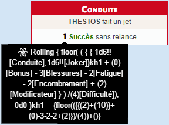
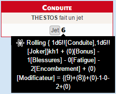

# Savage Worlds (french)

Feuille de personnage (FdP) avec jets intégrés pour **Savage Worlds**, basée sur le Livre de Base (LdB) de la version éditée en français par [Black Book Editions](http://www.black-book-editions.fr/index.php?site_id=278).

# Version courante
1.2 [Capture d'écran](sawofr.png)

#Divers notes

##A propos des jets
Dans le cadre de Savage Worlds et de cette FdP, activer l'option des dés 3D, automatiquement lancés, est fortement recommandé :

Les pénalités de jet dues aux Blessures, à la Fatigue et à l'Encombrement sont automatiquement prises en compte dans les 2 modes de jet (voir ci-dessous), et affichées/rappelées (pour information) dans le chat.

La feuille permet 2 types de jets :

* Option 1 : afficher **Succès + Relances**
* Option 2 : afficher les **Jets bruts**

Ce choix se fait par personnage,  en haut de la FdP, et peut être changé à tout moment (on peut passer de l'un à l'autre, au besoin) :

Que cela soit dans l'option 1 ou 2, un modificateur ponctuel/circonstanciel est toujours demandé :

Dans le cas des Jets de Lancer, de Tir, ou d'armes/attaques utilisant une de ces compétences, la Portée est demandée et intégrée au jet :

Pour les jets de Tir, l'utilisation du Dé Joket est optionnelle (pour gérer les Cadences de Tir supérieures à 1) et son utilisation doit être confirmée :

###Option 1 : Succès + Relances
La feuille demande une difficulté ou une cible (pour les jets d'attaques et dégâts) avant de lancer les dés.

Une cible dans Roll20 est un autre pion, lequel doit être associé à une feuille de personnage dont les caractéristiques ont été renseignées.

Le choix d'une cible ou le renseignement d'une difficulté permet de calculer et d'afficher la réussite du jet (d'attribut, compétence, attaque ou dégâts) avec la lecture suivante des résultats :

* 0 succès+relances : le jet est un échec,
* 1 succès+relances : le jet est une réussite, sans relance
* 2 succès+relances : le jet est une réussite, avec 1 relance
* 3 succès et relances : le jet est une réussite, avec 2 relances
* etc. (nombre de relance = résultat -1)

Le détail du calcul (et du résultat individuel des dés) est visible dans l'info-bulle du jet :

###Option 2 : Jets bruts
La feuille ne demande pas d'autre renseignement que le Modificateur circonstanciel (cf. ci-dessus), effectue le jet demandé (y compris dégâts s'il s'agit d'une arme/attaque) et affiche le total de chaque jet :

Au MJ et/ou aux joueurs de calculer la réussite ou l'échec, les relances éventuelles etc.

Le détail du calcul (et du résultat individuel des dés) est visible dans l'info-bulle du jet :

## Mise en place des pions
Les 3 "barres"/propriétés visibles des pions peuvent être associées à n'importe quel attribut de la FdP, à votre convenance.
Il n'y a (pour l'instant) aucun automatisme lié à ces propriétés.

##Raccourcis/barre de macro
Pour l'instant, sur le serveur de production de Roll20, les boutons contenus dans les sections dynamiques/répétables ne peuvent pas être glisser/déposer dans la barre de macro pour créer un bouton "raccourcis".
Cela concerne, sur le FdP : compétences supplémentaire (au-delà de la liste complète du LdB, intégrée dans la FdP), et les armes/attaques au-delà des 3 premières.
En effet, pour pallier ce problème, la FdP propose donc par défaut 3 armes/attaques "fixes", dont le bouton peut être utilisé en macro/raccourcis.

##Pouvoirs
Aucun jet/automatisme n'est pour l'instant intégré dans la FdP concernant les Pouvoirs.
Les suggestions sont les bienvenues à ce sujet.
NB : décrémenter les PP automatiquement au lancement d'un pouvoir nécessiterait l'utilisation d'un script API, donc d'un compte "Pro".

# Notes de version

##v1.2 (2015-12-22)

Equipement / Inventaire / Encombrement : ajout du poids individuel, gestion des poids décimaux, correction d'un bug lors de la suppression d'une ligne.

##v1.1 (2015-11-30)
Merci à The Aaron pour son script [TAS](https://github.com/shdwjk/TheAaronSheet).

* Ajout de sheet workers (nouveauté technique Roll20) pour :
    * alléger le recalcul des caractéristiques dérivées
    * automatiser le calcul automatique du poids total de l'équipement et donc de l'encombrement éventuel
    * éviter de saisir 2 fois la compétence des armes, selon le mode de jet choisi sur la feuille
* Ajout de l'affichage de la compétence utilisées dans les jets d'Armes.
* État du personnage plus détaillé dans les jets

##v1.0 (2015-11-16)
Création de la fiche.
