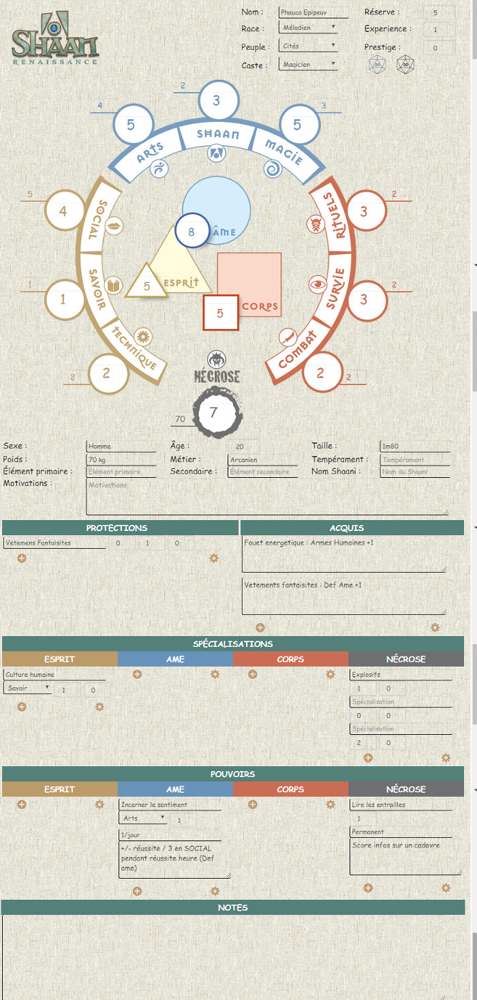

# SHAAN Renaissance

Feuille de personnage pour SHAAN Renaissance.
 
Plus d'informations : http://www.shaan-rpg.com/

Elle est en français mais comporte le moteur de traduction i18n.

## Version courante
1.0 

### La fiche

### Les templates

## v1.0 (2017-11-08)

Création de la fiche.

  * La fiche permet de stocker les informations du personnage
  * La gestion des dés est pour l'instant basique. Un jet de base avec les dés des trois trihns et un jet de nécrose.
