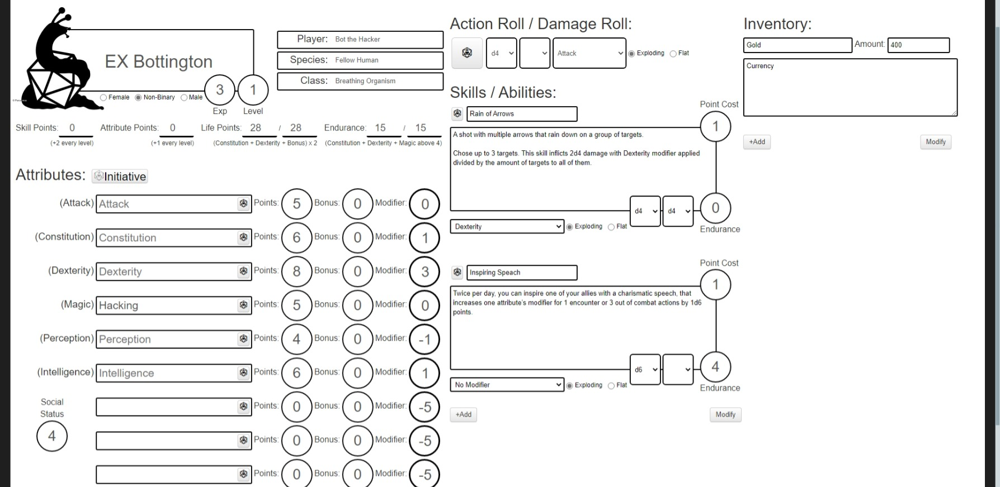

# Snice Roll20 Character Sheet
Official Roll20 Sheet for the Snice Pen & Paper RPG System

## List of Custom Values
To modify certain aspects of a character sheet that are auto calculated, there are certain hidden attribute values a GM can use to modify these by adding them to the Attributes / Abilities tab of a Roll20 character and using positive or negative numbers.

* Life_Points_Bonus = Adds on top of the calculated maximum Life_Points value.
* Attribute_Points_Bonus = Adds to the Total_Points value, the calculated remaining Attribute Points.
* Skill_Points_Bonus = Adds to the remaining Skill_Points value

## Additional Features
The Snice Roll20 Character Sheet contains a radio button option at the bottom to switch a specific character sheet between Player & NPC mode.
In NPC mode, all sheet controlled rolls, except for attack checks, are sent to the GM.

The sheet features a Skills / Abilities section in the design of the official Snice Skill Sheets, where Game Masters or players themselves can add their obtained skills, shortcuts for item action rolls, etc. The Point Cost field automatically decreases the remaining Skill Points if used to keep track of it.

Below the Skills / Abilities section, a basic Inventory section can be found where players can add a name, description and count of an item or use it to take notes.

## Further Information
If you are interested in knowing how to play, please refer to the official [**Snice Rulebook**](https://snice.parou.moe/), which comes with printable basic rule handouts for players, a Game Master specific section, as well as materials such as printable character sheets, pre-written skill sheets, blank skill sheets and more.

#

#### Copyright
Snice, the Snice logo, any official illustrations & materials like the Snice Character Sheet, as well as the Snice Roll20 Character Sheet Project are &copy; by Alice Peters (Parou), [Parou.moe](https://parou.moe/)
